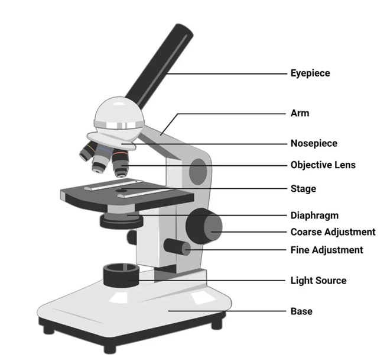
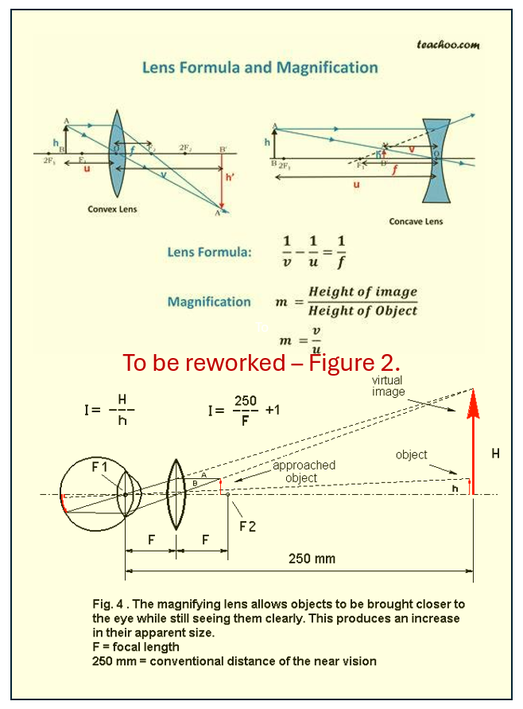
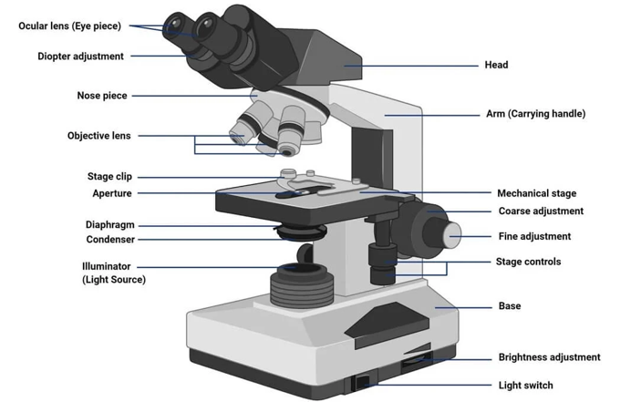
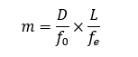
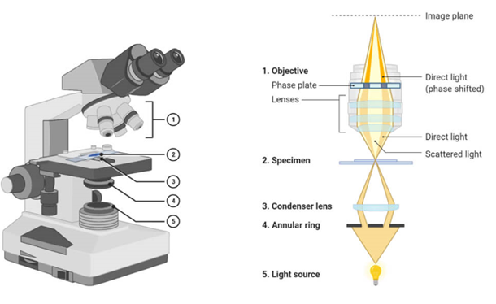
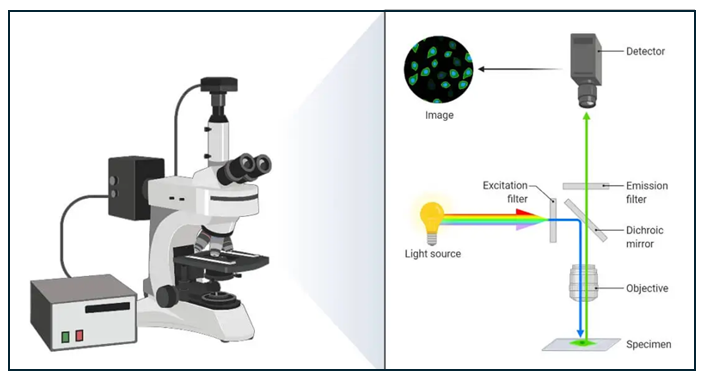
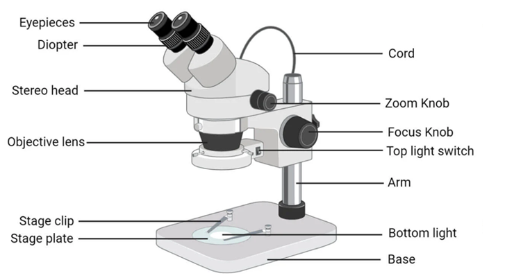

Various types of optical microscopes exist, which are utilized from learners to professionals to observe features of a specimen.  As there are multiple sources of providing the observation (i.e. through optical, electrons, or even forces) to observe the prepared surface of the specimen, the focus in this experiment will remain on the optical microscopes. Various types of optical microscopes include:   

<b>1. Simple Microscope : </b> 

Simple microscope, Figure 1, is where a single small focal length convex lens is used for magnification (say ~10 ×) using mirror (from ambient) as light source. The magnification is given by the ratio of the height of image to the height of the object, which is governed by the focal length of the utilized lens. 

 

Figure 1: Simple microscope utilises single lens to magnify the image. Courtesy:	https://microbenotes.com/types-of-microscopes/  

Specimen is focused via laws of optical physics of a convex lens, and results a virtual and magnified image at the least distance of distinct vision (Figure 2). Simple microscope utilizes minimal components including source of illumination, specimen stage, and convex objective lens for magnification. Simple microscope is typically utilized for quality checking in jewelry, watch-repair, electronic repairs, studying biological organisms etc.  

 

I -> Change to “m”, Magnifying power  
250 -> Change ‘250 to “D” or Least distance of distinct vision (~typically 250 mm for humans). 
m=H/h = D/F   
For eye: Image is formed on retina or at (H-h)   
Or (H-h)/h = D/F      or         H/h - 1 =D/F,           or     M = D/F + 1   

<b>2. Compound Microscope : </b> 

Compound microscope (Figure 3) utilizes set of lenses (i.e. objective and an eyepiece/ocular) to achieve the magnification (say tup to ~ 1000×). Herein, the primary magnification is achieved by the objective lens, that is again magnified by the eyepiece. Microstructural features of materials (such as steel, aluminum, titanium, etc) and also biological samples such as bacteria, cells, etc can be observed. As optical light (wavelength of 400 – 700 nm) is utilized, the resolution of a light microscope can be up to ~250 nm.  

 

Figure 3: Compound microscope utilizes multiple lenses and has variety of control measures for adjustments for scientific assessments.  

Magnifying power of the compound microscope is the multiplier of the magnifications achieved from that of objective lens and that from eyepiece, i.e. 

 

where,  
•	D is the least distance of distinct vision  (=250 mm for humans)  
•	L is the length of the microscope tube  
•	fo is the focal length of the objective lens  
•	fe is the focal length of the eyepiece   

<b>3. Phase Contrast Microscope : </b> 

Phase contrast microscope, Figure 4, utilizes small phase shift (say arising from different components of biological cell when light passes through it, or various compounds of various compositions in a reflective metallurgical sample) into different light intensity that can be appreciated by a human eye (in an otherwise similarly illuminated regions). Phase shift occur in the samples due to difference in the thickness of region or refractive index of the organelle or even the orientation of the crystalline material or varied composition/phase of the constituent material. As phase shifts occurring in those transparent or reflective regions are very small, those remain undetected to naked eye, but the phase contrast microscope amplifies these phase shifts into different intensity of light (or brightness) and results providing ‘contrast’ to an image. A supplemental ‘phase-plate’ insert converts phase shift into brightness change (or intensity change) and provides contrast to the formed image. Thus, various transparent organelles in a living cell appear ‘distinct’ without any dye-staining for better viewing.  

 

Figure 4: Phase contrast microscope utilizes amplifying the phase differences arising from the refractive index changes and converting that to change in the light intensity to result better contrast in the images.  

Phase contrast microscope consists of <b>condenser annulus diaphragm</b> that allows narrow hollow cone of light to pass through (via light-absorbing central circular disc) and a transparent periphery, and the <b>phase plate</b> (placed in the back focal plane of objective lens) allows selective passage of light through conjugate area (where the bright condenser annulus is focused), and restricted passage of light through complementary area (that is coated with light-retarding magnesium fluoride material).   

<b>4. Fluorescence Microscope : </b> 

Fluorescence microscope, Figure 5, uses fluorescence or phosphorescence to selectively dye a region of living cell or its organelles for identification. A monochromatic light is incident on a fluorescent-dye (fluorophore) stained object, which is passed through an excitation filter to selectively excite the fluorophore molecule (and block all other wavelengths). The high-energy light is reflected using dichroic filter (mirror that reflects short wavelength light) and directed to sample for fluorophore to get excited to higher energy levels. When the excited molecule/electron return to the ground state, higher wavelength of light is emitted. The emitted lower energy light (longer wavelength) is permitted to pass through the dichroic mirror (that does not permit passage of shorter wavelength light) to reach the detector. As the background is dark and the stained region (where the targeted cell or organelle specific to that dye is present and where relaxation of fluorophore molecule has actually occurred) appears bright, and a very high contrast is obtained.  

 

Figure 5: Fluorescence microscope where fluorophore dye-staining allows identification of living/dead cells and various organelles.  

<b>Fluorescence microscope requires : </b> 

<b>fluorophore molecule</b> that demonstrates ‘fluorescence’ (i.e. to re-emit light upon excitation). Fluorophore molecules are typically organic compounds that are aromatic or planar compounds with various pi-bonds (e.g. rhodamine, fluorescein, cyanine, acridine orange, etc).  
<b>high energy light source</b> (such as laser, mercury vapor lamp, xenon arc lamp, high power LED, etc) to emit high energy for exciting the fluorophore molecule.  
<b>Excitation filter</b> to allow high energy light (short wavelength) to pass through and block longer wavelength (or low energy) radiation to be able to trigger the excitation of fluorophore molecule.  
<b>emission filter</b> to block high-energy (short wavelength) radiation, and permit only the longer wavelength radiation to pass through and obtain a ‘signal’ of the image with dark background (to attain good contrast of the image).  
<b>dichroic mirror</b> reflects high energy light (shorter wavelength) traversed through excitation filter at an angle of 45 to fall on to the sample, but permits passage of high energy wavelength (lower energy wavelength) generated from fluorophore in stained sample on to the emission filter.   
lenses and other parts of compound microscope are also present in a fluorescence microscope.   

Fluorescence microscope may utilize same light path <b>(epi-fluorescence)</b> or utilize spatial pinhole to block out-of-focus light to develop 3-D image <b>(confocal microscope)</b>, or utilize multiple phonon for excitations of fluorophore to result 3-D image <b>(multiphoton microscope)</b> or even imaging in in aqueous environment near to solid surface with high refractive index to result high-resolution better contrast images <b>(total internal reflection fluorescence microscope)</b>.  

<b>5. Stereo Microscope :</b> 

Stereo microscope, Figure 6, utilizes two ocular lenses that focus on two different light paths and result an image that has a 3-dimensional appearance. As ambient light from top falls and gets reflected from the sample, a cone of light with multiple focal lengths is generated, and a 3-D perception is obtained for imaging using bottom-light for viewing. Fractured samples or geological samples and repair shops (mobile, electronic, watches, etc.) utilize stereo microscopes. 

 

Figure 6: Stereo microscope utilizes change of focus from the reflecting (and different light paths) to result a 3-dimensional appearing image.

